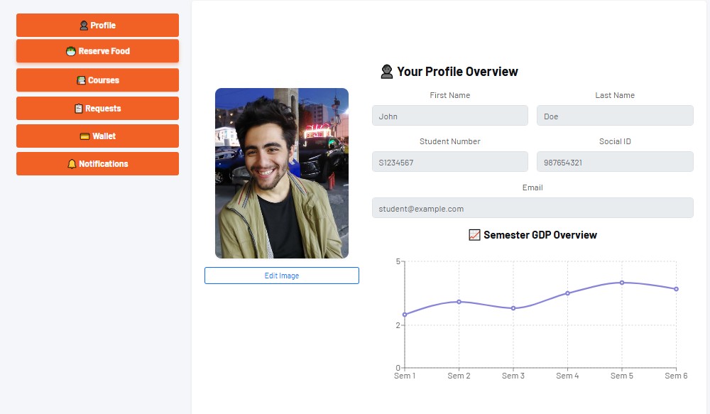

<h1 align="center">🏛️ University Portal Frontend</h1>

  A modern React-based frontend for a comprehensive University Portal — simplifying campus life with features like course management, food reservation, wallet top-ups, and more.

<h2>🔍 Overview</h2>

This project is the frontend for a university portal, built using <strong>React.js</strong>. It provides students with an intuitive and responsive interface to manage various aspects of university life, including:

<ul>
  <li>Viewing university information</li>
  <li>Account management (signup/login)</li>
  <li>Accessing a personal dashboard</li>
  <li>Reserving meals for upcoming days</li>
  <li>Viewing current semester courses</li>
  <li>Accessing course-related content including files and videos</li>
  <li>Submitting and managing requests</li>
  <li>Uploading documents to requests</li>
  <li>Checking wallet balance and adding funds</li>
  <li>Viewing notifications from the university</li>
</ul>

<h2>🎯 Features</h2>

<h3>🏠 Main Page</h3>

The main landing page introduces the university with essential information and links.

<h3>🔐 Authentication</h3>

Users can securely sign up or log in to access personalized dashboard features.

<h3>📋 Dashboard</h3>

Once logged in, users are directed to their dashboard where they can manage their profile and access key modules.

<h3>🍽️ Food Reservation</h3>

Students can reserve meals for the next 7 days. A clear and simple UI allows quick selection and confirmation.

<h3>📚 Course Management</h3>

All current semester courses are listed. Clicking a course provides detailed information, downloadable files, and embedded videos if available.

<h3>📝 Requests</h3>

Students can create, edit, delete, and track the status of various requests. File attachments are also supported.

<h3>💳 Wallet</h3>

Users can view their current balance and easily top-up funds needed for food reservations or other services.

<h3>🔔 Notifications</h3>

All official university notifications are displayed with timestamps, ensuring students never miss important updates.

<h2>🚀 Technologies Used</h2>

<ul>
  <li><strong>React.js</strong> — Frontend library</li>
  <li><strong>React Router</strong> — For navigation between pages</li>
  <li><strong>Axios</strong> — Handling API requests</li>
  <li><strong>CSS Modules / Tailwind / Styled Components</strong> — (Adjust based on your styling choice)</li>
</ul>

<h2>🛠️ Setup Instructions</h2>

<ol>
  <li>Clone the repository</li>
  <li>Run <code>npm install</code></li>
  <li>Run <code>npm start</code> to launch the frontend on <code>localhost:3000</code></li>
  <li>Ensure backend API is up and running to enable full functionality</li>
</ol>

<h2>🧑‍🎓 Author</h2>

Created with care by Mohammad Sarhangzadeh to simplify and enhance the campus experience.

  <em>Feel free to fork, contribute, or suggest improvements.</em>

